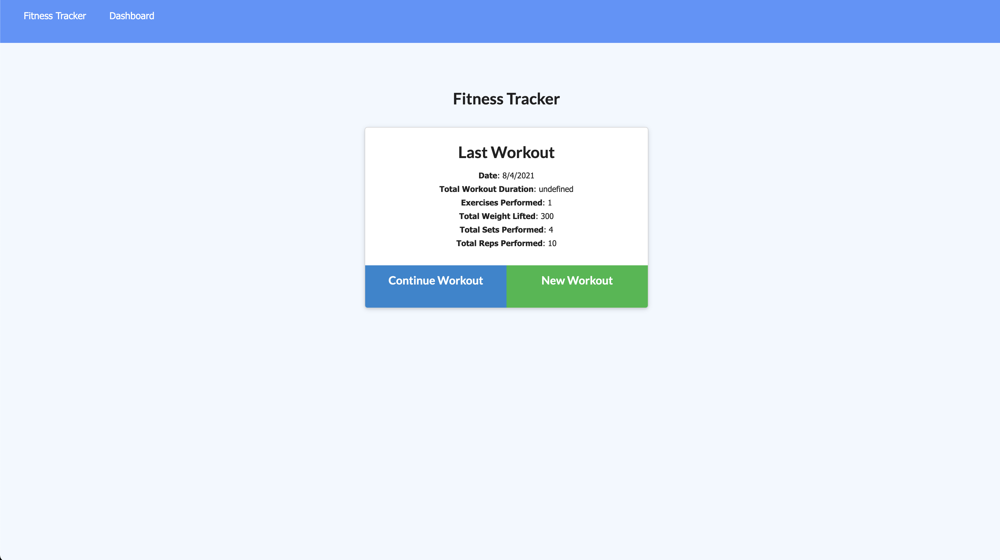
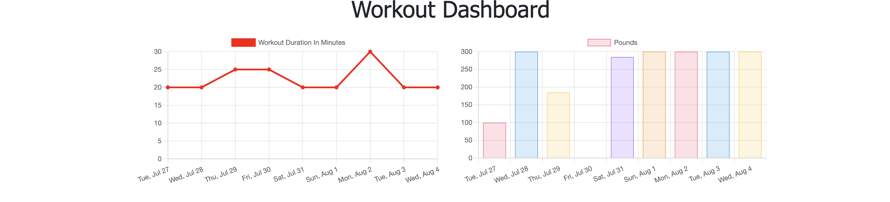

# Workout-Tracker

 

 

# Personalized Workout Tracker

This is a personalized workout tracker for your use. It requires a mongo database with a Mongoose schema and handle routes with Express. You will be able to view, create and track daily workouts. You will be able to log multiple exercises in a workout on a given day. You should also be able to track the name, type, weight, sets, reps, and duration of exercise. If the exercise is a cardio exercise, you should be able to track your distance traveled.

## Owned By

Emmett Rushin

## About

  * Add exercises to the most recent workout plan.

  * Add new exercises to a new workout plan.

  * View the combined weight of multiple exercises from the past seven workouts on the `stats` page.

  * View the total duration of each workout from the past seven workouts on the `stats` page.

## Deployed Site
[Deployed Site](https://workouttracker32432.herokuapp.com/)